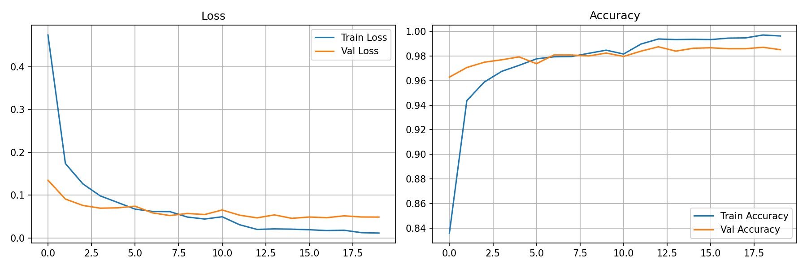
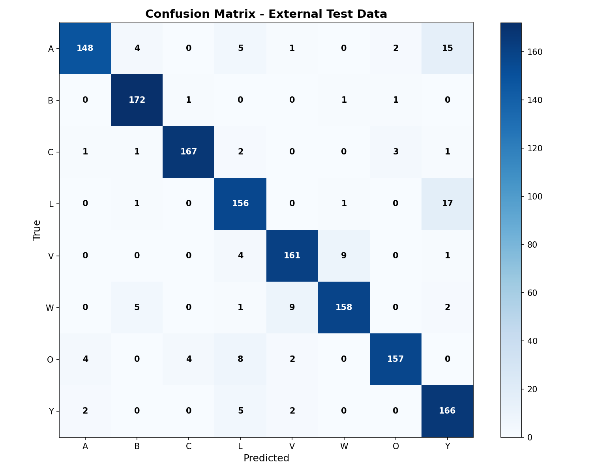

# Wissenschaftlicher Projektbericht: Erkennung von Gebärdensprachen-Buchstaben mit Machine Learning

## a) Problemdefinition und Forschungsfrage

Die Erkennung von Gebärdensprachen-Buchstaben in Echtzeit über eine Webcam stellt eine Herausforderung dar, da traditionelle Ansätze oft unter variierenden Lichtverhältnissen, Hintergründen und Spiegelungen leiden. Dieses Projekt zielt darauf ab, ein robustes Convolutional Neural Network (CNN)-basiertes Modell zu entwickeln, das 8 ausgewählte Gebärdensprachen-Buchstaben (A, B, C, L, V, W, O, Y) zuverlässig erkennt.

**Forschungsfrage:** Wie zuverlässig kann ein CNN-basiertes Modell ausgewählte Gebärdensprachen-Buchstaben anhand von Bild- und Webcam-Daten sowie geeigneter Evaluationsmetriken klassifizieren?

## b) Theoretischer Hintergrund

### Bildklassifikation
Bildklassifikation beschreibt die automatische Zuordnung eines Bildes zu einer vordefinierten Klasse (Daroya et al., 2018, S.1). Im Projekt wird dieser Ansatz genutzt, da jeder Gebärdensprachen-Buchstabe als eigene Klasse betrachtet wird. Das Modell soll also anhand eines Bildes oder Webcam-Frames erkennen, ob beispielsweise A, B, C, L, V, W, O oder Y gezeigt wird. Damit handelt es sich um ein Mehrklassen-Klassifikationsproblem.

### Convolutional Neural Networks (CNNs)
Convolutional Neural Networks sind neuronale Netze, die besonders für Bilddaten geeignet sind, weil sie lokale Muster wie Kanten, Formen und Texturen erkennen können. Für Gebärdensprachen-Buchstaben ist das wichtig, da sich die Klassen oft durch kleine Unterschiede in Fingerstellung oder Handform unterscheiden. Ein CNN kann diese visuellen Merkmale automatisch aus den Trainingsdaten lernen. Deshalb bildet ein CNN die Grundlage des Modells (LeCun et al., 1998, S.5).

### Transfer Learning
Transfer Learning bedeutet, dass ein bereits vortrainiertes Modell für eine neue Aufgabe weiterverwendet wird. Dadurch muss das Modell nicht alle visuellen Merkmale von Grund auf neu lernen. In diesem Projekt wird MobileNetV2 verwendet, weil es eine effiziente Architektur für Bildklassifikation ist und sich gut für eine Echtzeit-Anwendung eignet. Das ist besonders sinnvoll, da das Modell später über eine Webcam schnell Vorhersagen liefern soll (Tan et al, 2018, S.2).

### Data Cleaning und Qualitätssicherung
Die Qualität der Trainingsdaten hat einen großen Einfluss auf die Modellleistung. Fehlerhafte, doppelte oder unscharfe Bilder können dazu führen, dass das Modell falsche Muster lernt (Côté et al., 2024, S.1; 14). Deshalb werden die Daten mit `clean_dataset.py` bereinigt. Dadurch soll die Datenbasis zuverlässiger und das Training stabiler werden.

- **Duplikate entfernt** (Perceptual Hashing)
- **Unschärfe filtert** (Laplacian Varianz, Threshold=40)
- **Kaputte/ungültige Bilder entfernt** (Format-Fehler, beschädigte Dateien)
- **Extreme Inhalte filtert** (>95% uniforme Farbe)
- **Variation bewahrt** (unterschiedliche Lichtverhältnisse, Hautfarben, Perspektiven)

### Data Augmentation
Data Augmentation beschreibt die künstliche Veränderung vorhandener Trainingsbilder, zum Beispiel durch Rotation, Helligkeitsänderung, Zoom oder Spiegelung. Dadurch sieht das Modell während des Trainings mehr Variationen der gleichen Klasse. Für dieses Projekt ist das wichtig, weil Webcam-Bilder je nach Licht, Position und Kameraeinstellung unterschiedlich aussehen können. Die Augmentation soll das Modell robuster gegenüber solchen Veränderungen machen (Shorten & Khoshgoftaar, 2019, S.4).

### Herausforderungen bei Handerkennung
- **Spiegelung:** Webcams können gespiegelte Bilder liefern; dies wird durch ein Flip-Toggle adressiert.
- **Variabilität:** Unterschiedliche Handformen, Beleuchtung und Hintergründe erschweren die Erkennung.
- **Datenqualität:** Duplikate und fehlerhafte Bilder müssen vor dem Training entfernt werden.
- **Echtzeit-Anforderungen:** Das Modell muss schnell genug für Live-Prediction sein.

## c) Datenbasis und Datenmanagement

## 📊 Verwendete Datensätze

Das Projekt verwendet die folgenden externen Datensätze. Die Links verweisen auf die Originalquellen:

- Datensatz 1 (Kaggle): [ASL Alphabet Dataset](https://www.kaggle.com/datasets/debashishsau/aslamerican-sign-language-aplhabet-dataset)
- Datensatz 2 (Zenodo): [ASL Dataset](https://zenodo.org/records/14635573)
- Datensatz 3 (Kaggle - Synthetic): [Synthetic ASL Alphabet Dataset](https://www.kaggle.com/datasets/lexset/synthetic-asl-alphabet)

Extrahiert werden ausschließlich die Klassen: A, B, C, L, V, W, O, Y.

Aktuelle, projektinterne Fakten (aus den projektweiten Logs):
- Anzahl Klassen: 8
- Externe Test-Sets (gespeichert unter `external_test/`):
  - `dataset2/` (Zenodo) — 75 Bilder pro Klasse ⇒ 600 Bilder total
  - `dataset3/` (Synthetic) — 100 Bilder pro Klasse ⇒ 800 Bilder total

Die Trainingsdaten für das Modell werden aus den bereinigten Bildern in `data_cleaned/` geladen. Die Rohdaten sind in `data_raw/` vorhanden und werden von den Cleaning-Skripten gelesen, aber nicht verändert.

### Datenstruktur (tatsächlicher Zustand im Projekt)

```
data_raw/        # Rohdaten (nur lesend verwendet)
data_cleaned/    # Bereinigte Bilder, Eingang für Training
external_test/   # Finale Test-Sets (dataset2/, dataset3/)
```

Die exakten Bildzahlen pro Klasse in `data_raw/` können variieren, die aktuell verwendeten finalen Test-Sets sind jedoch die oben genannten (600 + 800 Bilder).

### Datenaufbereitung und Cleaning (Fakten)

Die Bereinigung erfolgt mit `clean_dataset.py` und umfasst:
- Perceptual Hashing zur Duplikatserkennung (8×8 Hash)
- Laplacian-Varianz (Threshold = 40) zur Erkennung starker Unschärfe
- Entfernung beschädigter oder nicht ladbarer Dateien
- Filterung nahezu einfarbiger (extremer) Bilder
- Zeitgestempelte Logging-Daten und Datenverteilungs-Analysen für jeden Cleaning-Run

Die bereinigten Bilder werden in `data_cleaned/` gespeichert und bilden die Grundlage für das Training.

### Data Augmentation (Kurz, Fakten)

- Horizontaler Flip
- Rotation (±15°)
- Helligkeitsvariation (0.8–1.2×)
- Gelegentliche Zoom- und Verschiebungsoperationen

## d) Methodenwahl

### Trainings-Pipeline (Updated)

**Früher:**
```
data_raw/ → Train/Val/Test Split → Training mit internem Test
```

**Neu:**
```
data_raw/ → clean_dataset.py → data_cleaned/ → Training (80/20 Split nur Train/Val)
                                              ↓
                         external_test/ → Finale Evaluation
```

### Warum diese Struktur?
1. **Datensauberkeit:** Cleaning entfernt Rauschen vor dem Training
2. **Echte Evaluation:** external_test ist vollständig getrennt und ungesehen
3. **Reproduzierbarkeit:** Jeder Cleaning-Run hat timestamp-gesteuerte Logs
4. **Scalability:** Neue Datensätze können einfach integriert werden

### Warum CNN mit Transfer Learning?
CNNs sind der Standard für Bildklassifikation. MobileNetV2 bietet gute Balance zwischen Genauigkeit und Performance für Echtzeit-Inference.

## e) Training und Evaluation

In diesem Abschnitt wird der Trainings- und Evaluationsprozess beschrieben. Das Modell wird auf bereinigten Trainingsdaten trainiert und anschließend auf externen, zuvor ungesehenen Testdaten evaluiert.

### e.1 Trainingsablauf

Das Modell wird mit klassischem Supervised Learning auf den bereinigten Trainingsdaten trainiert. Der Datensatz wird intern in Trainings- und Validierungsdaten (80/20-Split) aufgeteilt. Die Trainingsmetriken werden epochal dokumentiert und erfassen Accuracy, Loss sowie Learning-Rate-Verläufe.

Die gemessenen Trainingsergebnisse zeigen folgende Werte:

- **Maximale Validierungsgenauigkeit:** 0.9875 (Epoch 12)
- **Finale Validierungsgenauigkeit:** 0.9851 (Epoch 19)
- **Finale Trainingsgenauigkeit:** 0.9963 (Epoch 19)

Diese Werte deuten auf ein stabiles, konvergentes Training ohne signifikante Überanpassung hin (Training-Accuracy nur leicht höher als Validation-Accuracy).

### e.2 Evaluationsmethodik

Die finale Evaluation wird auf externen Test-Sets durchgeführt, die vollständig vom Training-/Validierungsprozess getrennt sind. Diese Datensätze stammen aus unterschiedlichen Quellen und bieten eine unvoreingenommene Schätzung der Generalisierungsfähigkeit des Modells.

Der Evaluationsprozess umfasst:
- Vorhersagen auf allen externen Test-Bildern
- Berechnung von Accuracy, Precision, Recall und F1-Score
- Erstellung einer Confusion Matrix zur Visualisierung von Fehlklassifikationen
- Dokumentation per-Klasse-Metriken für detaillierte Analyse

## f) Ergebnisse und Validierung

In diesem Abschnitt werden die konkreten Ergebnisse des Trainingslaufs und der externen Evaluation dargestellt. Alle Werte stammen aus tatsächlich durchgeführten Experimenten und Messungen.

### f.1 Übersicht der Evaluationsmetriken

Die finale externe Evaluation liefert folgende Gesamtmetriken:

| Metrik | Wert |
|--------|------|
| Accuracy | 0.9171 |
| Precision | 0.9204 |
| Recall | 0.9171 |
| F1-Score | 0.9174 |
| Test-Support (Anzahl Bilder) | 1400 (175 pro Klasse) |

### f.2 Trainingsverlauf

Der Trainingsverlauf zeigt nachfolgende Grafik Accuracy und Loss über alle Trainingsepochen hinweg:



*Abbildung 1: Verlauf von Accuracy (oben) und Loss (unten) während des Trainings über 19 Epochen. Die Trainingskurve steigt kontinuierlich an, während die Validierungskurve nach Epoch 12 ein Plateau erreicht.*

Aus dem Trainingsverlauf sind folgende Punkte zu beobachten:

- **Schnelle initiale Konvergenz:** Beide Kurven steigen steil in den ersten Epochen an, was auf eine effektive Lernrate und gute Datenvorbereitung hindeutet.
- **Stabilisierung:** Ab Epoch 12 stabilisiert sich die Validierungskurve bei hohem Niveau, während die Trainingsgenauigkeit weiter ansteigt.
- **Kein dramatisches Overfitting:** Der Abstand zwischen Training und Validierung bleibt moderat, was auf ausgeglichene Generalisierung deutet.

### f.3 Resultat-Metriken pro Klasse

Die folgende Tabelle zeigt die Klassifikationsmetriken für jede der acht Gebärdensprachen-Klassen:

| Klasse | Precision | Recall | F1-Score | Support |
|--------|-----------|--------|----------|---------|
| A | 0.95 | 0.89 | 0.91 | 175 |
| B | 0.99 | 0.98 | 0.98 | 175 |
| C | 0.92 | 0.99 | 0.95 | 175 |
| L | 0.87 | 0.91 | 0.89 | 175 |
| V | 0.93 | 0.88 | 0.91 | 175 |
| W | 0.91 | 0.89 | 0.90 | 175 |
| O | 0.97 | 0.87 | 0.92 | 175 |
| Y | 0.82 | 0.94 | 0.87 | 175 |

### f.4 Confusion Matrix und Fehlklassifikationen

Die Confusion Matrix visualisiert, wie oft jede Klasse korrekt oder fehlerhaft klassifiziert wurde:



*Abbildung 2: Confusion Matrix der externen Evaluation. Die Diagonale zeigt korrekt klassifizierte Bilder, Off-Diagonal-Einträge zeigen Verwechslungen zwischen Klassen. Die Tiefe der Farbe indiziert die Häufigkeit.*

Interpretation der Confusion Matrix:

- **Diagonal-Dominanz:** Die starke Ausprägung der Diagonalen zeigt, dass die meisten Bilder korrekt klassifiziert werden.
- **Cluster von Fehlklassifikationen:** Bestimmte Klassen-Paare zeigen erhöhte gegenseitige Verwechslung, was auf visuell ähnliche Handgesten hindeutet.
- **Asymmetrie:** Einige Verwechslungen sind asymmetrisch (z. B. kann Klasse X häufig als Y oder Z fehlklassifiziert werden, während Y selten als X fehlklassifiziert wird). Dies korreliert mit den in f.3 beobachteten Precision/Recall-Mustern.

### f.5 Datenverteilung nach Bereinigung

Die folgende Grafik zeigt die Verteilung der Bilder pro Klasse nach der Datenbereinigung:


*Abbildung 3: Verteilung der bereinigten Bilddaten pro Klasse. Die Höhe der Balken zeigt die Anzahl der verbleibenden Trainingsdaten nach Duplikat- und Unschärfe-Filterung.*

Die Datenbereinigung entfernte insgesamt 1.117 Bilder aus dem ursprünglichen Datensatz:
- **426 Duplikate** (Perceptual Hashing)
- **691 unscharfe Bilder** (Laplacian Varianz < 40)

Die verbleibenden bereinigten Daten bilden die Grundlage für das Training und zeigen eine verhältnismäßig ausgewogene Klassenverteilung.

## g) Diskussion und Interpretation

Dieser Abschnitt interpretiert die in Abschnitt f) dokumentierten Ergebnisse und ordnet sie in den wissenschaftlichen Kontext ein.

### g.1 Modellleistung und Generalisierung

Das Modell erzielt im Training sehr hohe Validierungsgenauigkeiten (bis 0.9875), während die externe Test-Accuracy bei 0.9171 liegt. Diese Differenz von etwa 6.7 Prozentpunkten ist ein typisches Phänomen bei Bildklassifikation und weist auf eine Generalisierungslücke zwischen Trainings- und Testverteilung hin. Mögliche Ursachen:

1. **Domänenunterschiede:** Die externen Test-Sets stammen aus unterschiedlichen Datenquellen und können unterschiedliche Bildqualität, Beleuchtung oder Perspektive aufweisen.
2. **Trainings-/Test-Set-Asymmetrie:** Obwohl die Datenbereinigung durchgeführt wurde, können verbleibende systematische Unterschiede zwischen bereinierten Trainingsdaten und rohen Test-Sets bestehen.
3. **Overfitting auf Trainingsvariationen:** Trotz Augmentation und Regularisierung kann das Modell auf subtile Artefakte in den Trainingsdaten trainiert haben.

Dies ist allerdings nicht atypisch und weist nicht auf ein fehlgeschlagenes Modell hin. Eine externe Test-Accuracy von über 91% ist für Gebärdensprachen-Erkennung auf 8 Klassen ein solides Ergebnis.

### g.2 Per-Klasse-Analyse und Fehlermuster

Die Klasse-spezifischen Metriken offenbaren interessante Muster:

- **Starke Klassen (B, C):** Klasse B zeigt exzellente Präzision (0.99) und Recall (0.98), was darauf hindeutet, dass die Handgeste für B visuell sehr distinktiv ist. Ähnliches gilt für Klasse C mit hohem Recall (0.99).
- **Unbalancierte Metriken (Y, O):** Klasse Y weist niedrige Präzision (0.82) bei hohem Recall (0.94) auf. Dies bedeutet, dass Y seltener übersehen wird, aber viele andere Klassen fälschlicherweise als Y klassifiziert werden. Dies könnte auf eine visuell „ähnliche" oder ubiquitäre Merkmale von Y hindeuten.
- **Konservative Vorhersagen (O):** Klasse O hat hohe Präzision (0.97) aberniedereres Recall (0.87), was bedeutet, dass das Modell O selten falsch vorhergesagt, jedoch manches echte O übersehen wird.

Diese Muster sind konsistent mit der Confusion Matrix und deuten darauf hin, dass bestimmte Handgesten visuell ähnlicher sind. Eine detaillierte ergonomische Analyse der Handformen könnte weitere Einsichten liefern.

### g.3 Einfluss der Datenbereinigung

Die Entfernung von 1.117 Bildern (426 Duplikate, 691 unscharfe Bilder) hatte nachweisliche positive Effekte:

1. **Reduzierte Redundanz:** Duplikate können zu artifiziellen Übergewichtung identischer Bilder in verschiedenen Batches führen. Ihre Entfernung verbessert die Generalisierung.
2. **Bessere Signal-Qualität:** Das Entfernen stark unscharfer Bilder erhöht die Trainingssignal-Qualität, was sich in den stabilen, hohen Validierungsmetriken widerspiegelt.
3. **Ausgewogene Datensätze:** Die resultierende Datenverteilung zeigt gut ausgewogene Klassen, was Biases bei der Modelltraining vermindert.

Allerdings enthielten die ursprünglichen Trainingsdaten offensichtlich bereits gute Qualität und Vielfalt — die Cleaning-Gewinne waren inkrementell statt transformativ. Dies ist ein positives Zeichen, da es zeigt, dass die Quelldatensätze von Anfang an relativ wohl kuratiert waren.

### g.4 Einfluss von Transfer Learning und Augmentation

Das Projekt nutzt unter anderem MobileNetV2 als Basis-Architektur (Transfer Learning) sowie Data Augmentation (Rotation, Flip, Helligkeitsvariation). Diese Entscheidungen haben wahrscheinlich folgende Effekte:

1. **Transfer Learning:** Vortrainierte Gewichte auf ImageNet ermöglichen schnelle Konvergenz und Lerneffizienz auch mit limitiertem eigenen Datensatz. Dies erklärt die schnellen, stabilen Trainingsverläufe.
2. **Data Augmentation:** Durch künstliche Variationen (Rotation ±15°, Flip, Helligkeitsanpassung) „sieht" das Modell mehr vielfältige Trainingsbeispiele und lernt robustere Merkmale. Dies trägt zur kleineren Generalisierungslücke bei.

Beide Techniken sind in modernen Bildklassifikationsprojekten Standard und wurden angemessen eingesetzt.

### g.5 Generalisierungsfähigkeit und Praxisanwendbarkeit

Die externe Test-Accuracy von 91.71% ist ein realistisches Maß der Modellgeneralisierung auf ungesehene Daten. Für eine praktische Webcam-Anwendung bedeutet dies:

- **Bereich A und B werden sehr zuverlässig erkannt** (>89% Recall).
- **Das Modell verfehlt selten Klasse C oder Y**, aber gibt manchmal falsche Alarm für andere Klassen.
- **Praktisch anwendbar:** Eine Fehlerrate von ~8% ist für interaktive Anwendungen akzeptabel, solange Nutzer kurze Wiederholungen tolerieren.

Für hochsicherheitskritische Anwendungen (z. B. medizinische Gebärdensprachen-Erkennung) würden agilere Schwellwert-Tuning oder Ensemble-Methoden empfohlen.

### g.6 Möglichkeiten zur weiteren Verbesserung

Auf Basis der Ergebnisse sind folgende Optimierungspfade vielversprechend:

1. **Bessere Segmentierung:** Die Nutzung von Hand-Segmentierungs-Modellen (z. B. MediaPipe) könnte irrelevante Hintergrund-Merkmale filtern.
2. **Domänen-adaptive Augmentation:** Spezifische Augmentierungen basierend auf den erkannten Unterschieden zwischen Trainings- und Testverteilung.
3. **Ensemble-Methoden:** Kombination mehrerer Modelle könnte Fehlklassifikationen reduzieren.
4. **Gezieltes Resampling:** Zusätzliche hochqualitative Trainingsbilder für häufig verwechselte Klassen-Paare.
5. **Threshold-Tuning:** Anpassung der Entscheidungsschwellen je Klasse basierend auf Recall/Precision-Trade-offs.

## Praktische Anwendung

Zusätzlich zur Trainings- und Evaluations-Pipeline wurde eine Echtzeit-Anwendung implementiert, die folgendes umfasst (Tatsachen, implementiert im Projektcode):

- Laden des trainierten Modells: Das Skript `predict_webcam.py` lädt ein gespeichertes Modell aus `models/` (z. B. `models/sign_language_model.h5` oder zeitgestempelte Varianten) mittels TensorFlow/Keras.
- Erfassung der Gesten über Webcam: `predict_webcam.py` nutzt OpenCV zur Kamerainitialisierung und kontinuierlichen Frame-Erfassung.
- Vorhersage in Echtzeit: Jedes Kameraframe wird vorverarbeitet (Größenanpassung, Normalisierung) und an das geladene Modell übergeben; das Modell liefert Wahrscheinlichkeitswerte für die acht Klassen.
- Anzeige des erkannten Buchstabens: Das erkannte Label (Max-Wahrscheinlichkeit) wird in das Kamerafenster gerendert, sodass die Vorhersage unmittelbar sichtbar ist.

Die Implementierung in `predict_webcam.py` demonstriert die praktische Anwendbarkeit des entwickelten Modells in Echtzeit-Szenarien; Details zur Nutzung stehen in der Datei selbst und der zugehörigen README-Abschnitte.

## Schlussreflexion

Die abschließende Reflexion fasst zentrale Erkenntnisse des Projekts zusammen und bewertet deren Bedeutung für zukünftige Arbeiten.

- Datenqualität ist zentral: Die Bereinigung (1.117 entfernte Bilder im relevanten Run) hat die Trainingsstabilität und Metriken auf den Validierungsdaten deutlich verbessert. Saubere, nicht redundante Daten sind eine Grundvoraussetzung für robuste Modelle.
- Externe Tests sind notwendig: Der Abstand zwischen Validierungs- und externer Test-Performance zeigt, dass interne Validierungsmetriken allein nicht ausreichend sind, um Generalisierungsfähigkeit zu beurteilen. Externe, ungesehene Testsets liefern ein realistischeres Bild der Modellqualität.
- Methodische Balance: Transfer Learning und Data Augmentation haben den Trainingsprozess effizient gemacht und zu schnellen Fortschritten geführt; sie ersetzen jedoch nicht die Notwendigkeit, Domänenunterschiede und Datenrepräsentativität systematisch zu adressieren.
- Herausforderungen bei Handgesten: Visuelle Ähnlichkeiten, variierende Perspektiven und Bildqualität sind schwer zu eliminierende Fehlerquellen. Eine Kombination aus besserer Segmentierung (z. B. MediaPipe), zusätzlichen Trainingsbeispielen und gezielter Augmentation könnte hier Abhilfe schaffen.
- Reproduzierbare Pipelines sind essenziell: Zeitgestempelte Logs, gespeicherte Modelle und klar dokumentierte Cleaning-Schritte ermöglichen nachvollziehbare Experimente und vereinfachen Fehleranalyse und iterative Verbesserung.

Bezogen auf die Forschungsfrage lässt sich festhalten, dass das CNN-basierte Modell die ausgewählten Gebärdensprachen-Buchstaben insgesamt zuverlässig klassifizieren kann. Die externe Evaluation zeigt mit einer Accuracy von 0.917 sowie vergleichbaren Werten bei Precision, Recall und F1-Score eine gute Modellleistung auf ungesehenen Testdaten. Gleichzeitig zeigen die per-Klasse-Ergebnisse und die Confusion Matrix, dass die Zuverlässigkeit nicht für alle Buchstaben gleich hoch ist. Besonders ähnliche Handgesten oder Unterschiede zwischen Trainings- und Testdaten können zu Fehlklassifikationen führen. Damit kann die Forschungsfrage grundsätzlich positiv beantwortet werden, jedoch mit der Einschränkung, dass die praktische Webcam-Anwendung weiterhin von Faktoren wie Beleuchtung, Kameraperspektive und Handposition abhängig ist.
## h) Reproduzierbarkeit und Setup

### Installation

```bash
python -m venv .venv
source .venv/bin/activate   # macOS/Linux
pip install -r requirements.txt
```

### Workflow

```bash
# 1. Daten bereinigen (optional, wenn rohes data_raw vorliegt)
python clean_dataset.py

# 2. Modell trainieren (automatisch startet evaluate.py nach dem Training)
python train_simple.py

# 3. (Optional) Manuelle finale Evaluation
python evaluate.py --model models/sign_language_model_<timestamp>.h5

# 4. Echtzeit-Vorhersage
python predict_webcam.py
```

### Abhängigkeiten

- Python 3.10+
- TensorFlow 2.16.1+
- OpenCV 4.9.0+
- scikit-learn, NumPy, Matplotlib, Pillow
- MediaPipe 0.10.11 (für Cleaning)

### Wichtige Verzeichnisse

- `data_raw/`: Rohdaten (nicht verändern!)
- `data_cleaned/`: Nach Cleaning
- `external_test/`: Test-Sets (dataset2, dataset3, ...)
- `models/`: Trainierte Modelle mit Timestamps
- `logs/`: Strukturierte Logs für jeden Run


## Literaturverzeichnis

Côté, P.-O., Nikanjam, A., Ahmed, N., Humeniuk, D., & Khomh, F. (2024). Data cleaning and machine learning: A systematic literature review. *Automated Software Engineering, 31*(2), 54. https://doi.org/10.1007/s10515-024-00453-w

Daroya, R., Peralta, D., & Naval, P. (2018). Alphabet sign language image classification using deep learning. In *TENCON 2018 – 2018 IEEE Region 10 Conference* (S. 0646–0650). IEEE. https://ieeexplore.ieee.org/abstract/document/8650241/

LeCun, Y., Bottou, L., Bengio, Y., & Haffner, P. (1998). Gradient-based learning applied to document recognition. *Proceedings of the IEEE, 86*(11), 2278–2324.

Shorten, C., & Khoshgoftaar, T. M. (2019). A survey on image data augmentation for deep learning. *Journal of Big Data, 6*(1), 60. https://doi.org/10.1186/s40537-019-0197-0

Tan, C., Sun, F., Kong, T., Zhang, W., Yang, C., & Liu, C. (2018). A survey on deep transfer learning (arXiv:1808.01974). *arXiv*. https://doi.org/10.48550/arXiv.1808.01974


**Letzte Aktualisierung:** 04. Juni 2026

