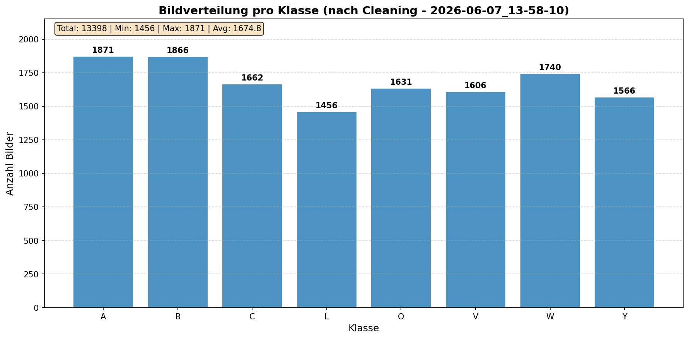

# Wissenschaftlicher Projektbericht: Erkennung von Gebärdensprachen-Buchstaben mit Machine Learning

## 1. Einleitung und Zieldefinition

Die automatische Erkennung von Gebärdensprachen-Buchstaben ist ein relevantes Anwendungsfeld des maschinellen Lernens, da sie die digitale Unterstützung der Kommunikation mit Gebärdensprache ermöglichen kann. In diesem Projekt wird untersucht, wie ausgewählte statische Buchstaben der American Sign Language (ASL) mithilfe eines bildbasierten Machine-Learning-Modells erkannt werden können. Der Fokus liegt dabei auf acht ausgewählten Klassen: **A, B, C, L, V, W, O und Y**.

Ziel des Projekts ist die Entwicklung eines CNN-basierten Klassifikationsmodells, das Gebärdensprachen-Buchstaben anhand von Bilddaten erkennt und zusätzlich in einer einfachen Webcam-Anwendung praktisch demonstriert werden kann. Neben der reinen Modellgenauigkeit wird besonderer Wert auf eine nachvollziehbare Datenpipeline, eine saubere Datenbereinigung, eine externe Evaluation und eine reproduzierbare Projektdokumentation gelegt.

**Forschungsfrage:**  
Wie zuverlässig kann ein CNN-basiertes Modell ausgewählte Gebärdensprachen-Buchstaben anhand von Bild- und Webcam-Daten sowie geeigneter Evaluationsmetriken klassifizieren?

Zur Beantwortung der Forschungsfrage werden unter anderem Accuracy, Precision, Recall, F1-Score und eine Confusion Matrix herangezogen. Dadurch wird nicht nur die Gesamtleistung des Modells bewertet, sondern auch analysiert, welche Klassen besonders zuverlässig erkannt werden und bei welchen Gebärden häufiger Fehlklassifikationen auftreten.

## 2. Theoretischer Hintergrund

### 2.1 Bildklassifikation

Bildklassifikation beschreibt die automatische Zuordnung eines Bildes zu einer vordefinierten Klasse (Daroya et al., 2018, S. 1). Im Projekt wird dieser Ansatz genutzt, da jeder Gebärdensprachen-Buchstabe als eigene Klasse betrachtet wird. Das Modell soll anhand eines Bildes oder Webcam-Frames erkennen, ob beispielsweise A, B, C, L, V, W, O oder Y gezeigt wird. Damit handelt es sich um ein Mehrklassen-Klassifikationsproblem.

### 2.2 Convolutional Neural Networks

Convolutional Neural Networks (CNNs) sind neuronale Netze, die besonders für Bilddaten geeignet sind, weil sie lokale Muster wie Kanten, Formen und Texturen erkennen können. Für Gebärdensprachen-Buchstaben ist das relevant, da sich die Klassen häufig durch kleine Unterschiede in Fingerstellung, Handform oder Silhouette unterscheiden. Ein CNN kann solche visuellen Merkmale automatisch aus den Trainingsdaten lernen und ist daher für die vorliegende Klassifikationsaufgabe geeignet (LeCun et al., 1998, S. 5).

### 2.3 Transfer Learning

Transfer Learning bedeutet, dass ein bereits vortrainiertes Modell für eine neue Aufgabe weiterverwendet wird. Dadurch muss das Modell nicht alle visuellen Merkmale von Grund auf neu lernen. In diesem Projekt wird MobileNetV2 verwendet, da diese Architektur eine gute Balance zwischen Genauigkeit und Rechenaufwand bietet und sich deshalb für eine spätere Echtzeit-Anwendung über die Webcam eignet (Tan et al., 2018, S. 2).

### 2.4 Data Cleaning und Qualitätssicherung

Die Qualität der Trainingsdaten hat einen großen Einfluss auf die Modellleistung. Fehlerhafte, doppelte oder unscharfe Bilder können dazu führen, dass das Modell falsche Muster lernt oder zu stark auf bestimmte Datenartefakte reagiert (Côté et al., 2024, S. 1; 14). Deshalb werden die Daten vor dem Training mit `clean_dataset.py` bereinigt.

Die Datenbereinigung umfasst unter anderem:

- Entfernung von Duplikaten mithilfe von Perceptual Hashing
- Filterung unscharfer Bilder über Laplacian-Varianz
- Entfernung beschädigter oder nicht lesbarer Dateien
- Filterung nahezu einfarbiger oder extremer Bildinhalte
- Erhalt visueller Variation, z. B. unterschiedliche Lichtverhältnisse und Perspektiven

Diese Schritte sollen die Datenbasis verlässlicher machen und die Grundlage für ein stabileres Training schaffen.

### 2.5 Data Augmentation

Data Augmentation beschreibt die künstliche Veränderung vorhandener Trainingsbilder, zum Beispiel durch Rotation, Helligkeitsänderung, Zoom oder Spiegelung. Dadurch sieht das Modell während des Trainings mehr Variationen derselben Klasse. Für dieses Projekt ist das wichtig, weil Webcam-Bilder je nach Licht, Position und Kameraeinstellung unterschiedlich aussehen können. Die Augmentation soll das Modell robuster gegenüber solchen Veränderungen machen (Shorten & Khoshgoftaar, 2019, S. 4).

### 2.6 Herausforderungen bei der Handgestenerkennung

Die Erkennung von Handgesten ist anspruchsvoll, da unterschiedliche Faktoren die Vorhersage beeinflussen können. Dazu gehören Beleuchtung, Hintergrund, Kamerawinkel, Handgröße, Bildqualität und mögliche Spiegelungen durch die Webcam. Zusätzlich sehen sich einige Gebärden visuell ähnlich, wodurch Fehlklassifikationen entstehen können. Diese Herausforderungen werden im Projekt durch Datenbereinigung, Data Augmentation, externe Testdaten und eine praktische Webcam-Anwendung berücksichtigt.

## 3. Datenbasis und Datenmanagement

### 3.1 Verwendete Datensätze

Das Projekt verwendet drei externe Datensätze:

- Datensatz 1 (Kaggle): [ASL Alphabet Dataset](https://www.kaggle.com/datasets/debashishsau/aslamerican-sign-language-aplhabet-dataset)
- Datensatz 2 (Zenodo): [ASL Dataset](https://zenodo.org/records/14635573)
- Datensatz 3 (Kaggle, synthetisch): [Synthetic ASL Alphabet Dataset](https://www.kaggle.com/datasets/lexset/synthetic-asl-alphabet)

Aus diesen Datensätzen werden ausschließlich die acht Klassen **A, B, C, L, V, W, O und Y** verwendet. Die Auswahl beschränkt den Projektumfang bewusst, damit Training, Evaluation und Webcam-Demo innerhalb des Modulprojekts realistisch umgesetzt werden können.

### 3.2 Datenstruktur

Die Projektstruktur trennt Rohdaten, bereinigte Daten und externe Testdaten:

```text
data_raw/        # Rohdaten
data_cleaned/    # bereinigte Trainingsdaten
external_test/   # externe Testdaten
```

Die Trainingsdaten werden aus `data_cleaned/` geladen. Die Rohdaten in `data_raw/` dienen als Ausgangsbasis für die Datenbereinigung. Die externen Testdaten unter `external_test/` werden nicht für das Training verwendet, sondern ausschließlich für die finale Evaluation.

### 3.3 Datenaufbereitung

Die Bereinigung erfolgt mit dem Skript `clean_dataset.py`. Dabei werden unter anderem doppelte, unscharfe oder beschädigte Bilder entfernt. Anschließend werden die Bilddaten für das Training vorbereitet und durch Data Augmentation erweitert. Dazu gehören:

- horizontaler Flip
- Rotation um bis zu ±15°
- Helligkeitsvariation
- Zoom- und Verschiebungsoperationen

Die Aufbereitung soll sicherstellen, dass das Modell nicht nur auf sehr einheitliche Trainingsbilder reagiert, sondern auch mit leichten Variationen umgehen kann.

## 4. Beschreibung der Methodik

### 4.1 Trainingspipeline

Die ursprüngliche Pipeline wurde so angepasst, dass die Daten zunächst bereinigt und erst danach für Training und Validierung genutzt werden:

```text
data_raw/ → clean_dataset.py → data_cleaned/ → Training und Validierung
                                      ↓
                              external_test/ → finale Evaluation
```

Diese Struktur wurde gewählt, weil die Datenqualität ein zentraler Faktor für die spätere Modellleistung ist. Durch die vorgelagerte Bereinigung wird offensichtliches Rauschen reduziert, bevor das Modell trainiert wird.

### 4.2 Modellwahl

Für die Klassifikation wird ein CNN-basierter Ansatz mit Transfer Learning verwendet. Als Basisarchitektur kommt MobileNetV2 zum Einsatz. Diese Entscheidung wurde getroffen, weil CNNs für Bildklassifikationsaufgaben gut geeignet sind und MobileNetV2 vergleichsweise effizient arbeitet. Dies ist besonders relevant, da das Modell nicht nur offline evaluiert, sondern auch in einer Webcam-Demo eingesetzt wird.

### 4.3 Begründung der getroffenen Entscheidungen

Die wichtigsten Entscheidungen im Projekt lassen sich wie folgt begründen:

| Entscheidung | Begründung |
|---|---|
| Auswahl von acht Klassen | Begrenzung des Projektumfangs und bessere Kontrollierbarkeit der Evaluation |
| Nutzung eines CNN-basierten Modells | Geeignet für visuelle Mustererkennung in Bilddaten |
| Einsatz von Transfer Learning | Effizienteres Training und Nutzung vortrainierter Merkmalsrepräsentationen |
| Datenbereinigung vor dem Training | Reduktion von Duplikaten, Unschärfe und beschädigten Dateien |
| Externe Testdaten | Realistischere Bewertung der Generalisierungsfähigkeit |
| Webcam-Demo | Praktische Demonstration der Anwendbarkeit des Modells |

### 4.4 Evaluation

Zur Bewertung des Modells werden mehrere Metriken verwendet:

- **Accuracy** zur Bewertung der Gesamtklassifikation
- **Precision** zur Analyse falsch positiver Vorhersagen
- **Recall** zur Analyse übersehener Klassen
- **F1-Score** als kombinierte Bewertung aus Precision und Recall
- **Confusion Matrix** zur Visualisierung von Fehlklassifikationen zwischen Klassen

Die finale Evaluation erfolgt auf externen Testdaten, die nicht im Training verwendet wurden. Dadurch soll verhindert werden, dass die Modellleistung nur auf interne Validierungsdaten bezogen wird.

## 5. Ergebnisse und Erkenntnisse

### 5.1 Übersicht der Evaluationsmetriken (aktuellste Logs)

Die finale externe Evaluation (neuester Classification Report: `logs/classification_reports/classification_report_2026-06-06_23-17-23.txt`) liefert folgende Gesamtmetriken:

| Metrik | Wert |
|---|---:|
| Accuracy | 0.9257 |
| Precision | 0.9281 |
| Recall | 0.9257 |
| F1-Score | 0.9259 |
| Test-Support | 1400 Bilder |

Die externe Accuracy von 0.9257 zeigt, dass das Modell nun rund 92.6 % der externen Testbilder korrekt klassifiziert. Die leicht verbesserten Werte bei Precision und F1 gegenüber der vorher dokumentierten Evaluation deuten auf eine insgesamt bessere Generalisierung auf das externe Test-Set hin.

### 5.2 Trainingsverlauf (aktuelle Trainingskurven)


*Abbildung 1: Verlauf von Accuracy und Loss während des Trainings (neueste Kurve: `logs/training_curves/training_curves_2026-06-06_19-45-28.png`).*

Der Trainingsverlauf zeigt eine schnelle Verbesserung in den ersten Epochen und anschließende Stabilisierung auf sehr hohem Niveau. Aus den Epoch-Metriken (`logs/training_metrics/epoch_metrics_2026-06-06_19-45-28.csv`) ergibt sich:

- Maximale Validierungsgenauigkeit (best epoch): 0.9886
- Validierungsgenauigkeit am Ende der aufgezeichneten Epochen: 0.9883
- Trainingsgenauigkeit (letzte Epoche): ca. 0.9983

Diese Zahlen zeigen ein starkes Training mit sehr hoher Trainingsgenauigkeit und ebenfalls sehr guter Validierungsleistung (höchste Val-Accuracy ≈ 98.86 %), was auf ein gut konvergiertes Modell hindeutet. Die Differenz zwischen Trainings- und Validierungswerten bleibt gering.

### 5.3 Ergebnisse pro Klasse (aktuell)

Aus dem neuesten Classification Report (`logs/classification_reports/classification_report_2026-06-06_23-17-23.txt`) ergeben sich die folgenden per-Klasse-Metriken (Support = 175 pro Klasse):

| Klasse | Precision | Recall | F1-Score | Support |
|---|---:|---:|---:|---:|
| A | 0.95 | 0.90 | 0.92 | 175 |
| B | 0.96 | 0.98 | 0.97 | 175 |
| C | 0.96 | 0.97 | 0.97 | 175 |
| L | 0.90 | 0.91 | 0.91 | 175 |
| V | 0.94 | 0.89 | 0.91 | 175 |
| W | 0.92 | 0.89 | 0.90 | 175 |
| O | 0.96 | 0.90 | 0.93 | 175 |
| Y | 0.83 | 0.96 | 0.89 | 175 |

Die per-Klasse-Ergebnisse zeigen weiterhin, dass die Klassen B und C besonders zuverlässig erkannt werden. Interessant ist die sehr hohe Recall-Rate für Y (0.96) bei gleichzeitig niedrigerer Precision (0.83), was darauf hinweist, dass echte Y-Bilder sehr selten übersehen, aber häufiger durch andere Klassen falsch vorhergesagt werden.

### 5.4 Confusion Matrix (aktuell)


*Abbildung 2: Confusion Matrix der externen Evaluation (neueste: `logs/confusion_matrices/confusion_matrix_2026-06-06_23-17-23.png`).*

Die Confusion Matrix bestätigt die per-Klasse-Metriken: die Diagonale ist stark ausgeprägt (hohe Trefferraten), während einige Off-Diagonal-Werte zeigen, welche Klassen häufiger verwechselt werden (z. B. leichte Verwechslungen zugunsten von Y in bestimmten Fällen).

### 5.5 Datenverteilung nach Bereinigung



*Abbildung 3: Verteilung der bereinigten Bilddaten pro Klasse.*

Die Datenbereinigung entfernte insgesamt 1.117 Bilder aus dem ursprünglichen Datensatz. Davon wurden 426 Bilder als Duplikate und 691 Bilder als unscharf identifiziert. Die verbleibenden Daten zeigen eine verhältnismäßig ausgeglichene Klassenverteilung und bilden die Grundlage für das Training.

## 6. Diskussion und Interpretation

### 6.1 Modellleistung und Generalisierung

Das Modell erreicht auf den internen Validierungsdaten sehr hohe Werte, während die externe Test-Accuracy bei 0.9171 liegt. Diese Differenz zeigt, dass die externen Testdaten anspruchsvoller sind und eine realistischere Einschätzung der Generalisierungsfähigkeit liefern. Die externe Accuracy von über 91 % ist für die betrachteten acht Klassen ein gutes Ergebnis, zeigt aber auch, dass das Modell nicht fehlerfrei arbeitet.

### 6.2 Fehlermuster

Die per-Klasse-Metriken und die Confusion Matrix zeigen, dass nicht alle Klassen gleich zuverlässig erkannt werden. Besonders auffällig ist die Klasse Y mit einer niedrigeren Precision. Das deutet darauf hin, dass andere Gebärden teilweise fälschlich als Y klassifiziert werden. Bei Klasse O ist der Recall geringer, was bedeutet, dass echte O-Bilder häufiger übersehen werden.

Diese Fehlermuster lassen sich vermutlich durch visuelle Ähnlichkeiten zwischen bestimmten Handgesten, Unterschiede in der Bildqualität und Domänenunterschiede zwischen Trainings- und Testdaten erklären.

### 6.3 Einfluss der Datenbereinigung

Die Datenbereinigung hatte eine wichtige Funktion im Projekt, da sie offensichtliches Rauschen aus den Trainingsdaten entfernt hat. Die Entfernung von Duplikaten reduziert die Gefahr, dass das Modell wiederholte Bilder zu stark gewichtet. Die Entfernung unscharfer Bilder verbessert die visuelle Qualität der Trainingsdaten. Dadurch wird die Grundlage für ein stabileres und nachvollziehbareres Training geschaffen.

### 6.4 Einfluss von Transfer Learning und Data Augmentation

Transfer Learning unterstützt das Training, da bereits gelernte visuelle Merkmale wiederverwendet werden. Dadurch kann das Modell schneller konvergieren und auch mit begrenzter Datenmenge sinnvolle Merkmale lernen. Data Augmentation erweitert die Variation der Trainingsbilder und trägt dazu bei, dass das Modell robuster gegenüber leichten Veränderungen in Beleuchtung, Position und Ausrichtung wird.

### 6.5 Praxisanwendbarkeit

Die Webcam-Anwendung zeigt, dass das trainierte Modell nicht nur theoretisch evaluiert, sondern auch praktisch eingesetzt werden kann. Über `predict_webcam.py` wird das Modell geladen, ein Kamerabild verarbeitet und die vorhergesagte Klasse direkt angezeigt. Die praktische Nutzung hängt jedoch weiterhin von äußeren Faktoren ab, zum Beispiel Beleuchtung, Kameraperspektive und Position der Hand.

## 7. Schlussfolgerung

Die Forschungsfrage kann grundsätzlich positiv beantwortet werden. Das CNN-basierte Modell klassifiziert die ausgewählten Gebärdensprachen-Buchstaben auf externen Testdaten mit einer Accuracy von 0.9171 und erreicht auch bei Precision, Recall und F1-Score gute Werte. Damit zeigt das Modell eine insgesamt zuverlässige Leistung für die acht betrachteten Klassen.

Gleichzeitig zeigen die Ergebnisse, dass die Zuverlässigkeit je nach Buchstabe variiert. Besonders die per-Klasse-Metriken und die Confusion Matrix machen deutlich, dass einzelne Klassen häufiger verwechselt werden. Für eine praktische Webcam-Anwendung ist das Modell daher gut geeignet, jedoch noch abhängig von kontrollierten Bedingungen wie guter Beleuchtung und klarer Handposition.

Insgesamt liefert das Projekt eine reproduzierbare und praxisnahe Umsetzung einer Gebärdensprachen-Buchstabenerkennung mit Machine Learning. Die Kombination aus Datenbereinigung, Transfer Learning, externer Evaluation und Webcam-Demo zeigt, dass der gewählte Ansatz für den Projektumfang angemessen ist.

## 8. Zukünftige Arbeiten

Für zukünftige Arbeiten ergeben sich mehrere Erweiterungsmöglichkeiten:

1. **Erweiterung auf das vollständige Alphabet:** Das Modell könnte auf weitere Buchstaben ausgeweitet werden.
2. **Integration von Bewegungsgebärden:** Buchstaben wie J und Z erfordern Bewegungsinformationen und könnten mit Videodaten behandelt werden.
3. **Bessere Handsegmentierung:** Verfahren wie MediaPipe könnten genutzt werden, um die Handregion zuverlässiger vom Hintergrund zu trennen.
4. **Mehr reale Webcam-Daten:** Zusätzliche Aufnahmen unter verschiedenen Licht- und Hintergrundbedingungen könnten die Praxisleistung verbessern.
5. **Optimierung für Echtzeit:** Das Modell könnte für schnellere Inferenz oder mobile Nutzung weiter optimiert werden.

## 9. Reproduzierbarkeit und Setup

### 9.1 Installation

```bash
python -m venv .venv
source .venv/bin/activate   # macOS/Linux
pip install -r requirements.txt
```

### 9.2 Workflow

```bash
# 1. Daten bereinigen
python clean_dataset.py

# 2. Modell trainieren
python train_simple.py

# 3. Modell evaluieren
python evaluate.py --model models/sign_language_model.h5

# 4. Echtzeit-Vorhersage starten
python predict_webcam.py
```

### 9.3 Abhängigkeiten

- Python 3.10+
- TensorFlow 2.16.1+
- OpenCV 4.9.0+
- scikit-learn
- NumPy
- Matplotlib
- Pillow
- MediaPipe 0.10.11

### 9.4 Wichtige Verzeichnisse

- `data_raw/`: Rohdaten
- `data_cleaned/`: bereinigte Trainingsdaten
- `external_test/`: externe Testdaten
- `models/`: trainiertes Modell
- `report_assets/`: Abbildungen für den Bericht

## 10. Literaturverzeichnis

Côté, P.-O., Nikanjam, A., Ahmed, N., Humeniuk, D., & Khomh, F. (2024). Data cleaning and machine learning: A systematic literature review. *Automated Software Engineering, 31*(2), 54. https://doi.org/10.1007/s10515-024-00453-w

Daroya, R., Peralta, D., & Naval, P. (2018). Alphabet sign language image classification using deep learning. In *TENCON 2018 – 2018 IEEE Region 10 Conference* (S. 0646–0650). IEEE. https://ieeexplore.ieee.org/abstract/document/8650241/

LeCun, Y., Bottou, L., Bengio, Y., & Haffner, P. (1998). Gradient-based learning applied to document recognition. *Proceedings of the IEEE, 86*(11), 2278–2324.

Shorten, C., & Khoshgoftaar, T. M. (2019). A survey on image data augmentation for deep learning. *Journal of Big Data, 6*(1), 60. https://doi.org/10.1186/s40537-019-0197-0

Tan, C., Sun, F., Kong, T., Zhang, W., Yang, C., & Liu, C. (2018). A survey on deep transfer learning (arXiv:1808.01974). *arXiv*. https://doi.org/10.48550/arXiv.1808.01974

**Letzte Aktualisierung:** 06. Juni 2026
